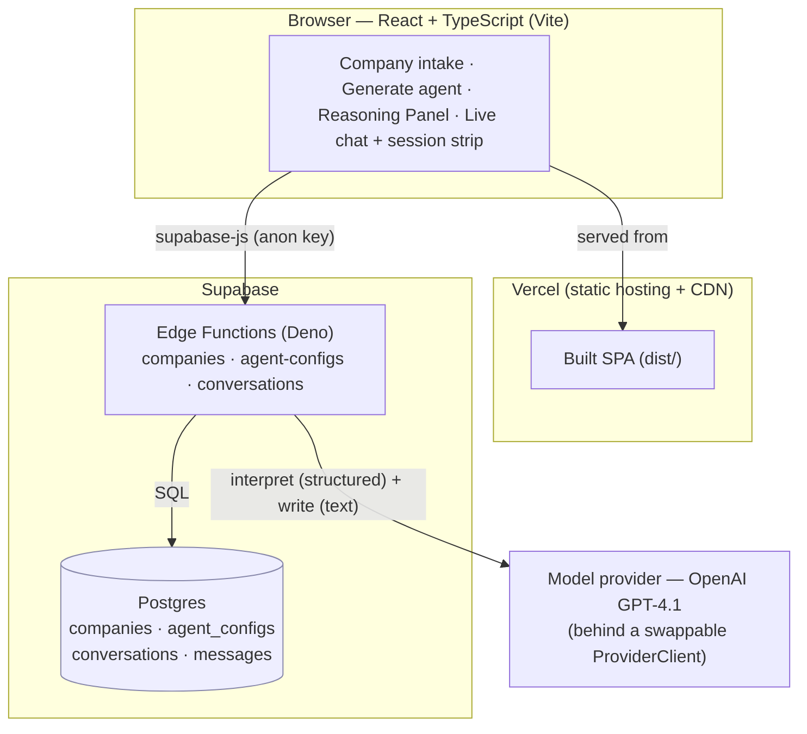

# Autonomous Staffing Agent

A full-stack web app for creating and running autonomous AI recruiting agents. You capture a company's
context (identity, culture, the profiles it hires for, tone); the agent configures itself from that
context — giving itself a personality — then plans and runs a candidate-engagement conversation,
**reasoning visibly about every step**.

**Live app:** https://autonomous-staffing-agent.vercel.app

> **What makes it intelligent, and not just an LLM call:** every turn is *two* model calls — the agent
> first **decides** (a structured `interpret` call that reads the situation and chooses the next-best
> action, with a grounding self-check) and only then **writes** the message. The decision is shown in a
> live Reasoning Panel, separate from the words. The agent reasons, commits to an action, checks itself
> against the company's context, and can choose *not* to act — escalate to a human or stop — rather than
> always replying.

---

## What it does

1. **Company intake** — capture a company's context: name, one-liner, culture, hiring needs, candidate
   profiles, recruiting process and goals, preferred tone.
2. **Personality inference** — one click generates the agent's persona (traits, voice rules, language
   style, boundaries) from that context. Sparse context yields a neutral, low-confidence persona rather
   than fabricated detail; the model's confidence is clamped to what the context actually supports.
3. **Opening outreach (turn 0)** — point the configured agent at a hypothetical candidate. It plans and
   writes the opening message, showing its reasoning.
4. **Multi-turn conversation** — reply as the candidate and watch the agent decide and respond each
   turn. A running **session** (stage, intent, sentiment, engagement, next action, status) is folded
   forward by a pure reducer and shown as a live strip.

Nothing is ever sent to a real channel — every message and its reasoning are stored and shown for
inspection only. The UI says so explicitly ("Sandbox — nothing sent").

---

## Architecture



The OpenAI key lives only in Edge Function secrets — it never reaches the browser. The client holds the
Supabase URL + anon key, which are public-safe.

### Decision flow (per turn)

Each conversational turn runs this pipeline server-side:

```
Company Context ──▶ Personality Inference ──▶ Agent Configuration
        │
        ▼
Candidate Context ──▶ Candidate Reply
        │
        ▼
  call 1 — INTERPRET (one structured decision):
     Intent / Sentiment ──▶ Confidence & Assumption check (known vs. inferred)
        ──▶ Session Update ──▶ Next-Best-Action ──▶ Grounding self-check
        │
        ▼
  Grounding Check (app handling): passed ──▶ proceed · failed/malformed ──▶ withhold + annotate
        │
        ▼
  call 2 — WRITE: Response Generation (in the company voice, inside its boundaries)
        │
        ▼
  Memory Update (session_state folded forward by the SessionReducer)
```

`interpret` returns a single structured `AgentDecision` (the contract the Reasoning Panel renders 1:1 and
that is stored verbatim on each agent message). `write` only phrases the already-decided action — it does
not change it. Two model calls per turn, always: decide first, write second.

---

## Key design decisions

- **Two-call loop (decide → write).** The autonomy lives in one place: the structured `interpret` call.
  Separating the decision from the prose is what makes the reasoning inspectable and the agent honest
  about *why* it's saying something.
- **Grounding is a self-check the app handles, not trusts blindly.** `interpret` self-reports five
  grounding flags + an overall `passed`. The app's `GroundingCheck` decides what to do with that:
  `passed` → show as-is; failed or malformed → withhold and annotate. A garbled model response degrades
  to "escalate to a human", never to a confident-but-unfounded message.
- **Honest personas.** No optional context → neutral low-confidence persona (no fabrication). Partial
  context → the model's confidence is clamped. Known facts are kept separate from inferred assumptions
  throughout.
- **Provider behind a seam.** All model calls go through a `ProviderClient` interface; swapping vendors
  is swapping one factory. Tests use a fake provider — no network, deterministic.
- **Deep modules, ports for I/O.** `DecisionEngine`, `MessageWriter`, `GroundingCheck`, `SessionReducer`,
  `PersonalityInference` are pure TypeScript shared by the Edge Function, the frontend types, and the
  tests. Persistence is behind injectable ports (Supabase in production, in-memory in tests).
- **Secrets server-side only.** Model keys live in Edge Function secrets; the browser only ever sees the
  anon key.

---

## Stack

- **Frontend:** React + TypeScript (Vite), Tailwind CSS, deployed on Vercel.
- **Backend:** Supabase — Postgres + Edge Functions (Deno). All model calls and business logic run
  server-side; secrets never reach the client.
- **Model:** OpenAI GPT-4.1, single model behind a swappable `ProviderClient`.
- **Tests:** Vitest — pure functions + fake provider/port (68 tests).

---

## Local development

```bash
npm install
cp .env.example .env   # then fill in your Supabase URL + anon key
npm run dev
```

`VITE_SUPABASE_URL` and `VITE_SUPABASE_ANON_KEY` are client-safe. Server-only secrets (service-role key,
the OpenAI key) live in Edge Function secrets and are never put in `.env`.

```bash
npm test          # run the test suite (Vitest)
npm run lint      # eslint
npm run build     # type-check + production build
```

## Deploy

### 1. Supabase

```bash
npx supabase login
npx supabase link --project-ref <your-project-ref>
npx supabase db push                        # applies migrations in supabase/migrations
npx supabase secrets set OPENAI_API_KEY=...  # model key (server-side only)
npx supabase functions deploy companies
npx supabase functions deploy agent-configs
npx supabase functions deploy conversations
```

### 2. Vercel

```bash
npx vercel            # link the project (first run)
npx vercel --prod     # deploy
```

Set `VITE_SUPABASE_URL` and `VITE_SUPABASE_ANON_KEY` as Vercel environment variables (Project → Settings
→ Environment Variables, **Production** scope) and rebuild — Vite inlines `VITE_*` at build time. Build
command `npm run build`, output `dist` (see `vercel.json`).

## Project layout

```
src/
  components/              React UI (CompanyForm, PersonaPanel, ReasoningPanel, TestArea, ui primitives)
  lib/                     browser clients + shared type surface (@/lib/types)
supabase/
  functions/_shared/       pure TS shared by Edge Functions, frontend types, and tests:
                             companies · personality · conversation · provider
  functions/companies/     company intake + retrieval
  functions/agent-configs/ personality inference
  functions/conversations/ the turn-0 + reply decision loop
  migrations/              SQL migrations
test/                      Vitest suites (companies · personality · conversation)
issues/                    PRD + build-slice specs
```

## How it was built

Six tracer-bullet slices, each deployed before the next:

1. **Walking skeleton** — frontend → Edge Function → Postgres, live on Vercel + Supabase.
2. **Company intake** — capture + persist company context.
3. **Personality inference** — the self-configuring agent persona (with honesty guardrails).
4. **Initial-outreach chat panel** — turn-0 interpret → write, the Reasoning Panel, grounding check.
5. **Candidate-reply turn loop** — multi-turn conversation + the SessionReducer.
6. **This** — README, architecture, final end-to-end verification.
